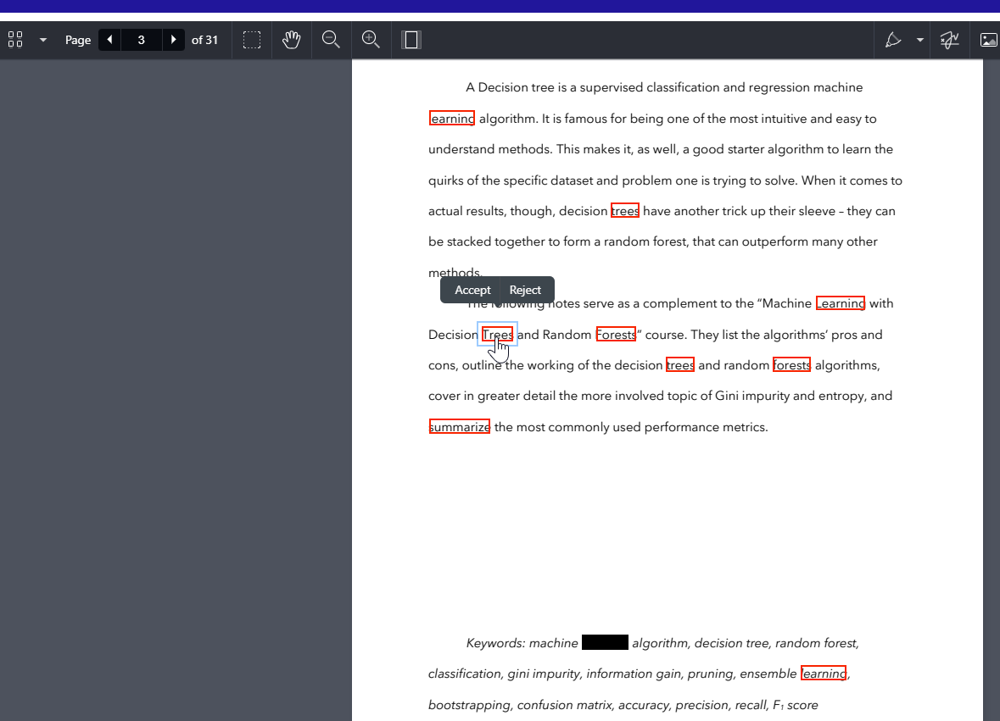

# Redact_onebyone_PSPDFKit

This is a simple sample project built in React, TypeScript, and Vite to mark the text for redactions programmatically using the PSPDFKit Web SDK. It allows users to review redaction annotations and either accept or reject them.

## Prerequisites

- Node.js (version 14 or later)
- npm (version 6 or later)

## Getting Started

1. Clone the repository:
    ```sh
    git clone https://github.com/Narashiman-K/Redact_onebyone_PSPDFKit.git
    cd Redact_onebyone_PSPDFKit
    ```

2. Install the project dependencies:
    ```sh
    npm install
    ```

3. Copy the PSPDFKit for Web library assets to the `public` directory:
    ```sh
    cp -R ./node_modules/pspdfkit/dist/pspdfkit-lib public/pspdfkit-lib
    ```

## Running the Development Server

  To start the development server, run:
      ```sh
      npm run dev
      ```

You can now open [http://localhost:5173](http://localhost:5173) in your browser and enjoy!

## Building for Production

  To create a production build of the app and serve it:
      ```sh
      npm run build
      npm run preview
      ```

Open your browser and navigate to [http://localhost:4173](http://localhost:4173) to see the application in action.

## License

This project is licensed under the Unlicense. See the LICENSE file for more details.

## Contributing

Please ensure you have signed our CLA so that we can accept your contributions.

## Support, Issues and License Questions

PSPDFKit offers support for customers with an active SDK license via [PSPDFKit Support](https://pspdfkit.com/support/request/).

Are you [evaluating our SDK](https://pspdfkit.com/try/)? That's great, we're happy to help out! To make sure this is fast, please use a work email and have someone from your company fill out our [sales form](https://pspdfkit.com/sales/).

## Disclaimer

This software is provided as-is, without warranty of any kind, express or implied, including but not limited to the warranties of merchantability, fitness for a particular purpose, and noninfringement. In no event shall the authors or copyright holders be liable for any claim, damages, or other liability, whether in an action of contract, tort, or otherwise, arising from, out of, or in connection with the software or the use or other dealings in the software.

The user is solely responsible for determining the appropriateness of using or redistributing the software and assumes any risks associated with the exercise of permissions under the license.

## About

This project allows you to mark text for redactions using the PSPDFKit Web SDK, review the redaction annotations, and either accept or reject them.



## Author

Narashiman Krishnamurthy


